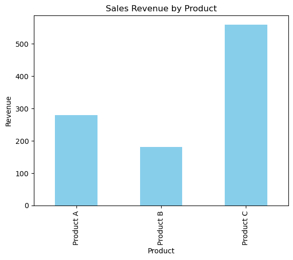

Create the SQLite Database

```python
import sqlite3

# Connect to (or create) the database
conn = sqlite3.connect("sales_data.db")
cursor = conn.cursor()

# Create table
cursor.execute("""
    CREATE TABLE IF NOT EXISTS sales (
        product TEXT,
        quantity INTEGER,
        price REAL
    )
""")

# Insert sample data
cursor.executemany("INSERT INTO sales VALUES (?, ?, ?)", [
    ("Product A", 5, 10.0),
    ("Product B", 3, 15.0),
    ("Product A", 2, 10.0),
    ("Product C", 7, 20.0),
])

conn.commit()
conn.close()

```

Query Sales Data Using SQL

Now, connecting to the database and run a SQL query to get total quantities and revenue for each product.


```python
import pandas as pd

# Connect to the SQLite database
conn = sqlite3.connect("sales_data.db")

# SQL query to aggregate quantity and revenue
query = """
    SELECT product, SUM(quantity) AS total_qty, SUM(quantity * price) AS revenue
    FROM sales GROUP BY product
"""

# Load the results into a pandas DataFrame
df = pd.read_sql_query(query, conn)

# Close the database connection
conn.close()

```
Display the Sales Summary

Printing the DataFrame to check the query results.

```python
print(df)

```

         product  total_qty  revenue
    0  Product A         28    280.0
    1  Product B         12    180.0
    2  Product C         28    560.0
    
Visualize Revenue Using Matplotlib

Generating a simple bar chart to visualize revenue per product.

```python
import matplotlib.pyplot as plt

# Plot bar chart
df.plot(kind='bar', x='product', y='revenue', color='skyblue', legend=False)

# Add labels and title
plt.xlabel("Product")
plt.ylabel("Revenue")
plt.title("Sales Revenue by Product")

# Save the chart (optional)
plt.savefig("sales_chart.png")

# Display the chart
plt.show()

```


    

    

